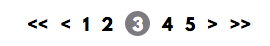

Here is a quick way how you can make make a pagination that indicates the current page with a few pages around it. This is specific example is done with the Liquid syntax in Jekyll, with pagination done via the Octopress Paginate plugin. But the concept is pretty simple, so you should be apple to apply it to most other templating engines.



Here is what it will look like.

Create a div for your pagination, and a ul within that.



```html
<div class="pagination">
	<ul>
	</ul>
</div>
```

Now within the <ul> tag, we're going to add links to the next and previous page, if those pages exist (note: `/blog/1` is an invalid url, so we have to be sure that the first page link goes to just `/blog/`).

```html
<ul>
	<!-- go back -->
	
		<li>
			
				<a href="/blog/{{ paginator.previous_page }}">&lt;</a>
			
				<a href="/blog/">&lt;</a>
			
		</li>
	
	
	<!-- go forward -->
	
		<li><a href="/blog/{{ paginator.next_page }}">&gt;</a></li>
	
</ul>
```

Now let's add links to the first and the last page, so people can quickly jump around. These links will only show if the user is not already on the first or last page.

Before the go back link add:

```html

	<li><a href="/blog/">&lt;&lt;</a></li>

```

After the go forward link:

```html

	<li><a href="/blog/{{ paginator.total_pages }}">&gt;&gt;

```

Now it's time for the meat of pagination. This example is only going to show five pages total, but you can change the number on either side to adjust.

between the go back and forward links add:

```html


	

```

This gets the page number two pages before the current one, and ensures that if we won't have a page range that starts on a nonexistant page.

Below this add

```html


	

```

Much like with pagination_start, this gets to pages after the current page, but won't exceed the actual amount of pages.

We want to have at least five pages showing (assuming 5 or more pages exist), and currently this will only do that if the current page has two pages before and after (i.e. if on page one the range is only 1, 2, 3). So below the last code block add

```html

	

```

Now if there aren't two pages before the current page, there will be more pages after.

Ok, so we have a range of pages, now let's actually show them. To do this we're going to create a loop like so (again because `/blog/1` doesn't work, we're going to assign the href via a variable)

```html

	
		
	
		
	
	
	
		<li class="current-page"><a href="{{ page_href }}">{{ i }}</a></li>
	
		<li><a href="{{ page_href }}">{{ i }}</a></li>
	

```

This shows the surrounding page with proper links, and lets us style the current page differently.

## Complete Code

```html
<div class="pagination">
	<ul>
		
			<li><a href="/blog/">&lt;&lt;</a></li>
		
		
			<li>
				
					<a href="/blog/{{ paginator.previous_page }}">&lt;</a></li>
				
					<a href="/blog/">&lt;</a>
				
			</li>
		

		
		
			
		

		
		
			
		
		
			
		

		
			
				
			
				
			

			
				<li class="current-page"><a href="{{ page_href }}">{{ i }}</a></li>
			
				<li><a href="{{ page_href }}">{{ i }}</a></li>
			
		

		
			<li><a href="/blog/{{ paginator.next_page }}">&gt;</a></li>
		
		
			<li><a href="/blog/{{ paginator.total_pages }}">&gt;&gt;</a></li>
			
	</ul>
</div>
```

A quick example of how to style it can be done like this with your CSS

```css
.pagination {
  width: 100%;
  padding: 0 20px;
  text-align: center;
}
.pagination ul {
  list-style: none;
}
.pagination ul li {
  display: inline
  margin: 0 5px;
}
.pagination ul li a {
  color: black;
  text-decoration: none;
}
.pagination ul li a:hover {
  color: grey;
  text-decoration: underline;
}
.pagination ul li.current-page a {
  color: red;
}
```

